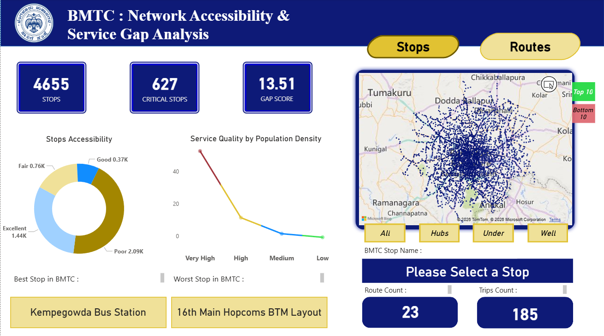

# BMTC Transit Network Accessibility & Service Gap Analysis 🚌📊

An end-to-end geospatial and business intelligence analysis of the Bengaluru Metropolitan Transport Corporation (BMTC) bus network. This project identifies critical service gaps, evaluates network accessibility, and highlights supply-demand bottlenecks across the city using Python, Geospatial mapping, and advanced Power BI DAX.

## 📸 Dashboard Previews

*(Replace the dummy links below with the actual paths to your uploaded images in the repo)*

*Figure 1: The Stops Dashboard providing a macro-level view of network health, accessibility scores, and critical stops.*

*Figure 2: The Routes Dashboard featuring interactive mapping, dynamic route insights, and stops sequence tables.*

*Figure 3: The Routes Dashboard featuring interactive mapping, dynamic route insights, and the Top 10 analysis tables.*

---

## 🎯 The Business Problem
Bengaluru is one of the fastest-growing cities in the world, leading to rapidly shifting population densities. The core challenge for BMTC is resource allocation: **Are buses deployed where the people actually are?** Relying purely on "Total Population" or "Total Trips" creates a false sense of security. Highly populated routes might look well-served on paper, but if the bus frequency is too low, the route becomes a severe bottleneck. This project was built to transition transit data from static reporting to actionable operational intelligence.

## 🛠️ The Data Analyst Approach & Geospatial Engineering

Power BI is a world-class visualization tool, but it is not a native Geographic Information System (GIS). To accurately analyze the transit network, the heavy lifting had to be done in Python before the data ever reached the dashboard.

1.  **Geospatial Processing (`geopandas`)**: The raw data contained text-based geometry (`LINESTRING` for routes, `POINT` for stops). I parsed these, reprojected the Coordinate Reference System (CRS) to a metric standard (EPSG:3857), and drew precise 50-meter spatial buffers around every bus route.
2.  **Spatial Joins**: I performed a spatial join (`sjoin`) to accurately map which specific bus stops fell within the buffer of which routes. 
3.  **Avoiding the "Summing Circles" Trap**: Simply summing the 1km population radius of every stop on a route leads to massive double-counting due to overlapping catchment areas. The spatial pre-processing allowed for accurate, deduplicated population exposure metrics.

## 🧠 Key Technical Features & Custom DAX

* **The Pressure Index (Crowding Risk)**: A custom metric created to measure true supply-demand strain. Calculated by dividing the *Average Population* along a route by its *Total Daily Trips*. 
    * *Impact*: Shifts focus from "Who passes the most people?" to "Which routes have thousands of residents relying on a single scheduled bus?"
* **Disconnected Slicer Architecture**: Implemented a disconnected parameter table and utilized advanced DAX (`ISFILTERED`, `COALESCE`) to build a "Bouncer" logic for the map visual. This prevented Power BI's native cross-filtering from clashing when users interacted with both single-select slicers and Top 10 tables simultaneously.
* **Dynamic KPI Measures**: Built measures that adapt calculations dynamically based on complex UI interactions, bypassing standard visual filter limitations.

## 📈 Key Findings & Business Impact

By deploying this analytical model against the BMTC dataset, the dashboard revealed several high-value insights:

* **Identified 627 Critical Stops**: Pinpointed specific locations suffering from poor accessibility levels despite being situated in high-density population zones.
* **Exposed Hidden Bottlenecks**: Discovered that several top-tier routes operate with a **Pressure Index exceeding 400+**, meaning hundreds of potential passengers are competing for a single scheduled bus trip.
* **Optimized Fleet Deployment targeting**: Isolated the "Top 10 Dense Routes" that are currently starved of frequency. Re-routing just 5-10% of the spare fleet to these specific lines would directly alleviate crowding for over **870,000+ residents**.
* **Automated Insight Generation**: Built a DAX-driven insight engine that automatically translates complex pressure metrics into actionable, plain-English text for non-technical transit planners.

## ⚙️ Tech Stack
* **Data Prep & Geospatial**: Python (`pandas`, `geopandas`, `shapely`)
* **BI & Visualization**: Power BI (Desktop & Service)
* **Languages**: DAX, SQL, Python

---

### ⚠️ Important Note for Running the `.pbix` File
If you download the Power BI file and the visuals appear broken or the dataset fails to load, the absolute file paths to the local CSVs need to be updated.
**Fix:** Open Power BI -> Go to `Home` -> `Transform Data` -> `Data source settings` -> `Change Source` and point the files to the respective datasets located in the `/data` folder of this repository.
