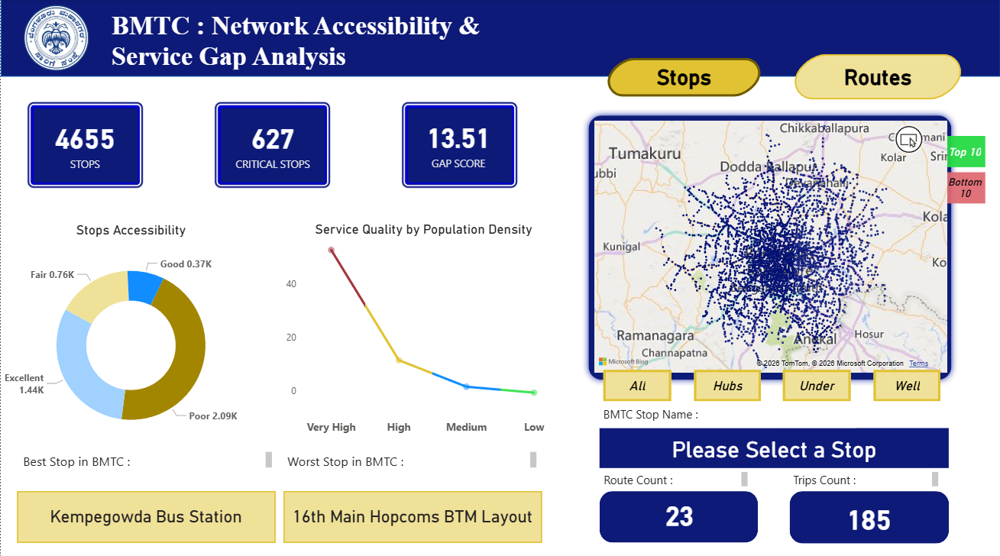
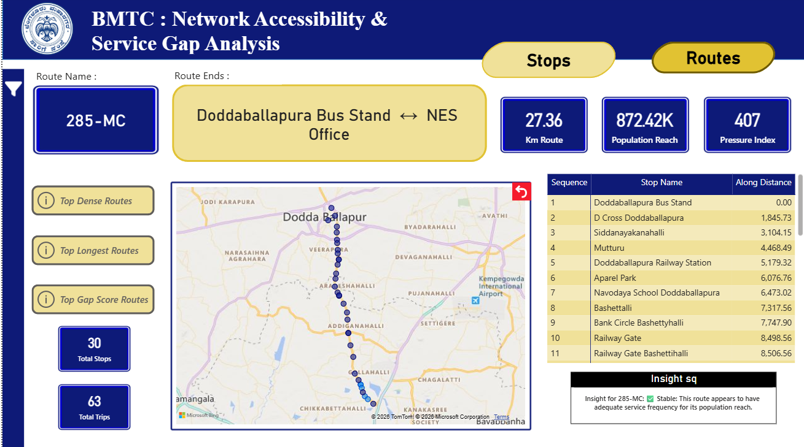
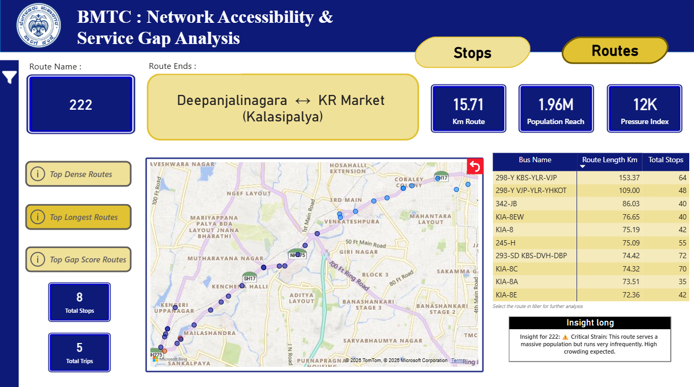

# 🚌 BMTC Transit Network Accessibility & Service Gap Analysis

An end-to-end geospatial and business intelligence project analyzing the Bengaluru Metropolitan Transport Corporation (BMTC) bus network. The project combines Python, GeoPandas, and Power BI to identify service gaps, evaluate network accessibility, and compare transit supply with surrounding population demand.

---

## 📸 Dashboard Preview

*Figure 1: Overview of network accessibility, service levels, and critical bus stops.*

*Figure 2: Interactive route analysis with route mapping and stop sequence details.*

*Figure 3: Route-level rankings and Top 10 accessibility analysis.*

---

# 🎯 Project Overview

Bengaluru's rapid urban growth makes efficient public transport planning increasingly difficult. While BMTC publishes route and stop information, it does not directly answer an important operational question:

**Are bus services distributed according to where people actually live?**

This project combines transit, geospatial, and population datasets to build an interactive analytical model that highlights underserved areas, identifies high-pressure routes, and supports better transit planning.

---

# 🛠 Data Preparation & Geospatial Analysis

Most of the analytical work was completed in Python before building the Power BI dashboard.

### Geospatial Processing

The original datasets contained route geometries (`LINESTRING`) and stop locations (`POINT`). Using GeoPandas, these datasets were processed, reprojected into a metric coordinate system (EPSG:3857), and prepared for spatial analysis.

### Spatial Matching

A 50-meter buffer was created around every route, allowing nearby bus stops to be matched accurately through spatial joins. This produced a new route-stop mapping dataset used throughout the analysis.

### Population Integration

To estimate transit demand, population data from the GHSL dataset was integrated with bus stop locations. Care was taken to avoid double-counting population across overlapping service areas, producing more reliable demand estimates.

---

# 📊 Key Features

### Pressure Index (Custom Metric)

Developed a custom metric combining estimated population coverage with daily trip frequency to highlight routes that may experience higher passenger demand relative to available service.

### Dynamic Route Analysis

Built interactive DAX measures allowing users to switch between route rankings, accessibility metrics, and service gap analysis without changing the underlying dashboard structure.

### Automated Insight Panel

Created DAX-driven insight cards that automatically summarize key findings in simple language, making the dashboard easier to interpret for non-technical users.

---

# 📈 Key Findings

* Identified **627 bus stops** located in densely populated areas with relatively limited service.
* Highlighted routes with significantly higher Pressure Index values, indicating potential supply-demand imbalance.
* Ranked high-density routes to support data-driven discussions around service prioritization and fleet allocation.
* Combined geospatial analysis with Power BI reporting to provide a more complete picture of transit accessibility across Bengaluru.

---

# ⚙️ Tech Stack

**Data Preparation & Geospatial**

* Python
* Pandas
* GeoPandas
* Shapely

**Business Intelligence**

* Power BI
* DAX

**Languages**

* Python
* SQL

---

## ⚠️ Running the Power BI File

If the PBIX file does not load correctly after download, update the local CSV file paths:

**Home → Transform Data → Data Source Settings → Change Source**

Then point Power BI to the datasets stored in the `/data` folder of this repository.

---
